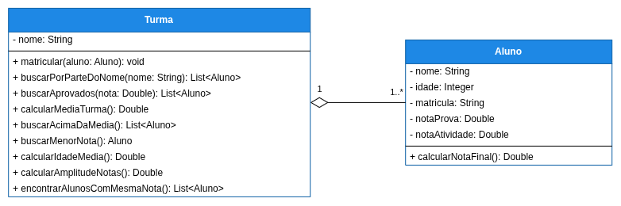

# Exercício Relacionamento 📎

## Orientações Gerais: 🚨
1. Utilize **apenas** tipos **wrapper** para criar atributos e métodos.
2. **Respeite** os nomes de atributos e métodos definidos no exercício.
3. Tome **cuidado** com os **argumentos** especificados no exercício.
   **Não** adicione argumentos não solicitados e mantenha a ordem definida no enunciado.
4. Verifique se **não** há **erros de compilação** no projeto antes de enviar.
5. As classes devem seguir as regras de encapsulamento.

## Exercício 1 — Carrinho

Implemente o seguinte diagrama de classes:

### Métodos da classe `Produto`:

* Deve conter todos os getters e setters

### Métodos da classe `Carrinho`

- `Integer getQuantidade()`:

  * **Retorna** a quantidade de `Produtos` incluídos no `Carrinho`

- `void adicionar(Produto produto)`:
  * Adiciona o produto recebido na lista de produtos

- `Boolean existsPorNome(String nome)`:
  * **Retorna** se um produto existe dentro do `Carrinho` pelo nome
  * Deve ignorar letras maiúsculas e minúsculas (Case Insensitive)

  

- `Integer getQuantidadePorCategoria(String nome)`:
  * **Retorna** a quantidade produtos de uma determinada categoria

  

- `void limpar()`
  * Remove todos os produtos do carrinho

  
- `void removerPorNome(String nome)`
  * Remove um produto de dentro do carrinho a partir do nome
  * Deve ignorar letras maiúsculas e minúsculas (Case Insensitive)

- `Produto getPorNome(String nome)`
  * **Retorna** o produto do carrinho a partir do nome
  * Caso o produto não seja encontrado retorne null
  * Deve ignorar letras maiúsculas e minúsculas (Case Insensitive)

- `Double getValorTotal()`
  * **Retorna** a soma dos preços de todos os produtos

## Exercício 2 — Turma

Implemente o seguinte diagrama de classes:

### Métodos da classe `Aluno`:

* Deve conter todos os getters e setters

- `Double calcularNotaFinal()`:
  * **Retorna** a média ponderada da nota da prova (peso 70%) e da nota da atividade (peso 30%)

### Métodos da classe `Turma`

- `void matricular(Aluno aluno)`:
  * Valida o aluno antes de adicionar: `nome` não pode ser nulo/vazio, `idade` não pode ser nula
    nem negativa, `notaProva` e `notaAtividade` não podem ser nulas e devem estar entre 0.0 e 10.0
    (inclusive)
  * Se o aluno for inválido, **não** adiciona.

- `List<Aluno> buscarPorParteDoNome(String nome)`:
  * **Retorna** os alunos da turma a partir do nome
  * Caso não seja encontrado nenhum, retorne uma lista vazia
  * Deve ignorar letras maiúsculas e minúsculas 
  * Deve pesquisar apenas por uma parte do nome
  * Exemplo: se o nome do aluno for "João da Silva", a busca por "da" deve retornar o aluno

- `List<Aluno> buscarAprovados(Double notaMinima)`:
  * **Retorna** todos os alunos com nota final maior ou igual à nota mínima informada

- `Double calcularMediaTurma()`:
  * **Retorna** a média das notas finais de todos os alunos
  * Caso a turma esteja vazia retorne `0.0`

- `List<Aluno> buscarAcimaDaMedia()`:
  * **Retorna** todos os alunos com nota final acima da média da turma.

- `Aluno buscarMenorNota()`:
  * **Retorna** o aluno com a menor nota final da turma
  * Caso a turma esteja vazia retorne `null`

- `Double calcularIdadeMedia()`:
  * **Retorna** a média das idades de todos os alunos
  * Caso a turma esteja vazia retorne `0.0`

- `Double calcularAmplitudeNotas()`:
  * **Retorna** a amplitude das notas finais da turma, ou seja, a diferença entre a maior e a menor
    nota final entre os alunos (amplitude = maior nota final - menor nota final)
  * Indica o quão espalhadas estão as notas: quanto maior a amplitude, maior a diferença entre o
    aluno com a melhor e o aluno com a pior nota final da turma
  * Caso a turma esteja vazia retorne `0.0`

- `List<Aluno> encontrarAlunosComMesmaNota()`:
  * **Retorna** uma lista de alunos que possuem a mesma nota final
  * Caso não haja alunos com a mesma nota retorne uma lista vazia

