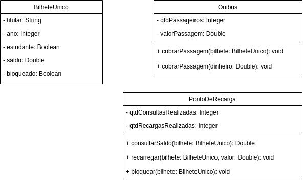
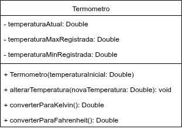
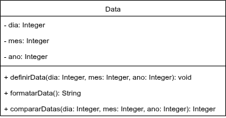
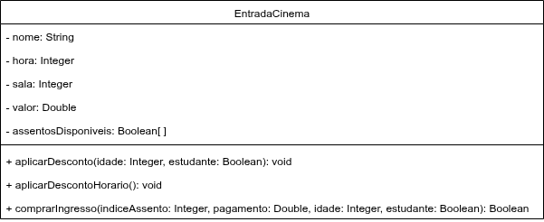
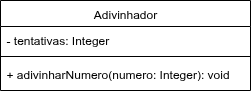

# Exercício - Encapsulamento e UML 📎

## Orientações Gerais: 🚨
1. Utilize **apenas** tipos **wrapper** para criar atributos e métodos.
2. **Respeite** os nomes de atributos e métodos definidos no exercício.
3. Tome **cuidado** com os **argumentos** especificados no exercício.
   **Não** adicione argumentos não solicitados e mantenha a ordem definida no enunciado.
4. Verifique se **não** há **erros de compilação** no projeto antes de enviar.
5. As classes devem seguir as regras de encapsulamento.

## Exercício 1 - Bilhete Único 🚩

Implemente o seguinte diagrama de classes:

Métodos da classe `BilheteUnico`:

* A classe deve conter apenas os métodos getters e setter para acessar e alterar o valor dos atributos.

Métodos da classe `Onibus`:

* A classe deve conter os métodos getters para acessar os atributos.

* cobrarPassagem(bilhete: BilheteUnico)
  * verifica se o bilhete está bloqueado e caso esteja exibe a mensagem
    "bilhete único bloqueado"
  * verifica se existe saldo o suficiente no bilhete e caso não exista, 
  exibe a mensagem "Não há saldo suficiente para realizar a operação"
  * atualiza o valor do **saldo** do bilhete
  * estudantes pagam metade do valor da passagem
  * atualiza o atributo **qtdPassageiros**

* cobrarPassagem(dinheiro: Double)
  * verifica se o valor em **dinheiro** fornecido é suficiente para pagar a passagem e caso 
  não seja exibe a mensagem "Dinheiro insuficiente para realizar a operação"
  * atualiza o atributo **qtdPassageiros**

  
Métodos da classe `PontoDeRecarga`:

* A classe deve conter os métodos getters para acessar os atributos.

* consultarSaldo(bilhete: BilheteUnico)
  * verifica se o bilhete está bloqueado e caso esteja exibe a mensagem
    "bilhete único bloqueado", retorna 0 e não atualiza o atributo **qtdConsultasRealizadas**
  * atualiza o atributo **qtdConsultasRealizadas**
  * **retorna** o valor atual de saldo do bilhete

* recarregar(bilhete: BilheteUnico, valor: Double)
  * verifica se o valor de recarga é de pelo menos R$ 5,00 (Valor mínimo) e caso não seja
  exibe a mensagem "Valor mínimo de recarga não atingido"
  * verifica se o bilhete está bloqueado e caso esteja exibe a mensagem
  "bilhete único bloqueado"
  * atualiza o valor do **saldo** do bilhete adicionando o valor da recarga
  * atualiza o atributo **qtdRecargasRealizadas**

* bloquear(bilhete: BilheteUnico)
  * atualiza o atributo **bloqueado** do bilhete único

## Exercício 2 - Termômetro 🚩

Implemente o seguinte diagrama de classe:

No construtor da classe `Termometro`
* Atribua o valor recebido pelo construtor nos 3 atributos da classe

Métodos da classe `Termometro`

* A classe deve conter os métodos getters para acessar o valor dos atributos.

* alterarTemperatura(novaTemperatura: Double)
  * atualiza o atributo **temperaturaAtual** com o valor de **novaTemperatura**
    * caso o **novaTemperatura** seja nulo, não altere o valor do atributo
  * se o **temperaturaAtual** for mais quente que o atual valor do atributo **temperaturaMaxRegistrada**, atualize o valor do **temperaturaMaxRegistrada**
  * se o **temperaturaAtual** for mais frio que o atual valor do atributo **temperaturaMinRegistrada**, atualize o valor do **temperaturaMinRegistrada**

* converterParaKelvin()
  * **retorna** a conversão de temperaturaAtual (em Celsius) para Kelvin, fórmula:
    * (K = °C + 273,15)

* converterParaFahrenheit()
  * **retorna** a conversão de temperaturaAtual (em Celsius) para Fahrenheit, fórmula:
    * (°F = °C × 1,8 + 32)

## Exercício 3 - Data 🚩

Implemente o seguinte diagrama de classe:

**AVISO: Não é para usar classes / métodos do Java que trabalham com data**

Métodos da classe `Data`

* A classe deve conter os métodos getters para acessar o valor dos atributos.

* definirData(dia: Integer, mes: Integer, ano: Integer)
  * atualiza os atributos **dia**, **mes** e **ano** com os valores recebidos
  * **dia** precisa estar entre 1 e 31
    * também precisa ser um dia válido naquele mês (Exemplo: janeiro possui o dia 31, já abril só vai até o dia 30) 
    * precisa considerar se o ano é bissexto, se for, fevereiro possui 29 dias, se não, tem apenas 28
  * **mes** precisa estar entre 1 e 12
  * **ano** não pode ser negativo

* formatarData()
  * **retorna** um texto com os valores presentes nos atributos no formato DD/MM/AAAA
    * o texto retornado precisa ser exatamente no formato mostrado acima, sem acrescentar mais nada

* compararDatas(dia: Integer, mes: Integer, ano: Integer)
  * **retorna** 1 se a data informada for maior que a data atual do objeto
  * **retorna** 0 se a data informada for igual a data atual do objeto
  * **retorna** -1 se a data informada for menor que a data atual do objeto

## Exercício 4 - Entrada de Cinema 🚩

Implemente o seguinte diagrama de classe:

Métodos da classe `EntradaCinema`

* A classe deve conter os métodos getters para acessar o valor dos atributos.

* aplicarDesconto(idade: Integer, estudante: Boolean)
  * atualiza o atributo **valor** com o cupom desconto adequado
    * se menor de 3 anos ganha 100% de desconto
    * se menor de 12 anos ganha 50% de desconto
    * se estudante e tiver entre 12 a 15 anos ganha 40% de desconto
    * se estudante e tiver entre 16 a 20 anos ganha 30% de desconto
    * se estudante e tiver acima de 20 anos ganha 20% de desconto
  * **idade** não pode ser negativa

* aplicarDescontoHorario()
  * atualiza o atributo **valor** aplicando 10% de desconto se o filme for exibido antes das 16h

* comprarIngresso(indiceAssento: Integer, pagamento: Double, idade: Integer, estudante: Boolean)
  * precisa aplicar os descontos no valor do ingresso (caso atenda alguma das condições de cada desconto)
  * **retorna** false se o assento escolhido já estiver ocupado (ou seja, se o valor dele for **false**) ou se o pagamento for insuficiente para cobrir o preço do ingresso
    * atualiza o valor do ingresso para o valor original (pré-descontos)
  * **retorna** true se o assento escolhido não estiver ocupado (ou seja, se o valor dele for **true**) e se o pagamento for o suficiente para cobrir o preço do ingresso
    * atualiza o valor do assento escolhido para ocupado (valor fica **false**)

## Exercício 5 - Adivinhador 🚩

Implemente o seguinte diagrama de classe:

Métodos da classe `Adivinhador`

* A classe deve conter os métodos getters para acessar o valor do atributo.

* adivinharNumero(numero: Integer)
  * sorteia números aleatórios entre 0 e 50 até encontrar o número fornecido
  * exibe o número da tentativa e o número sorteado a cada iteração
  * exibe "O número X foi sorteado após Y tentativas." quando encontrado
